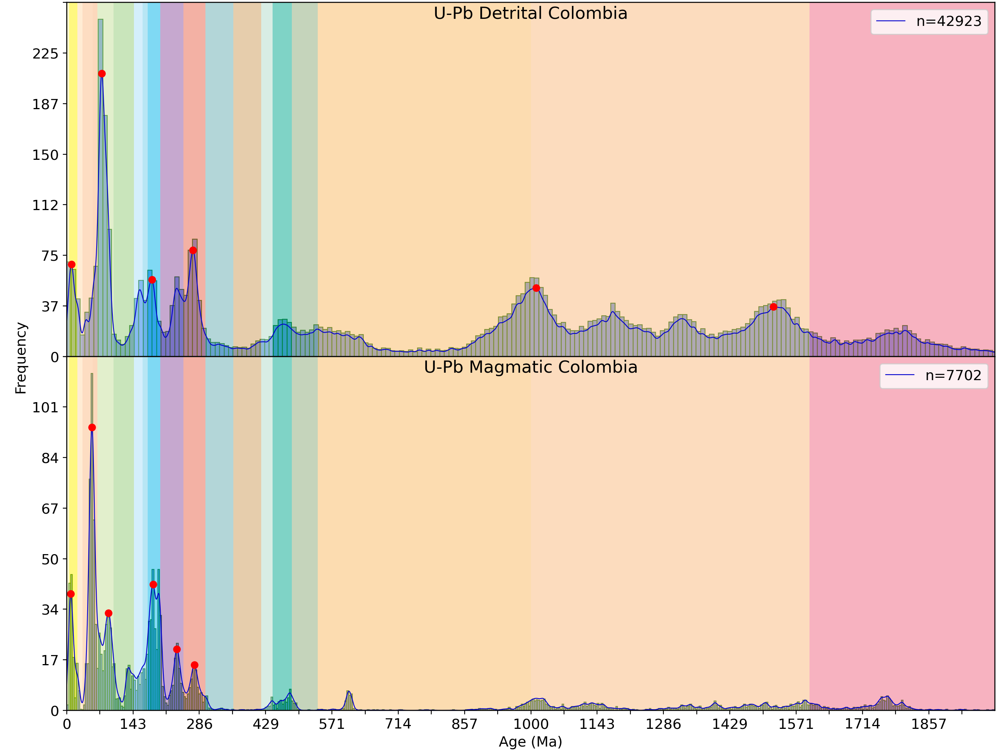
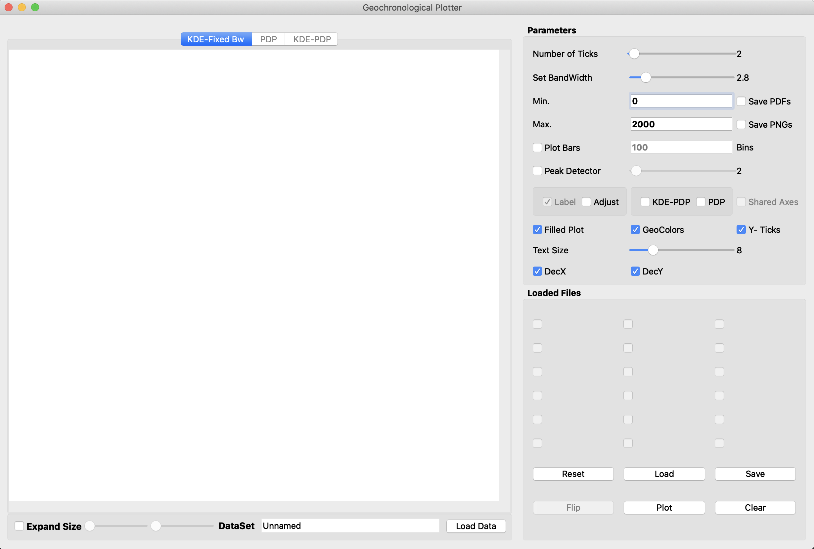
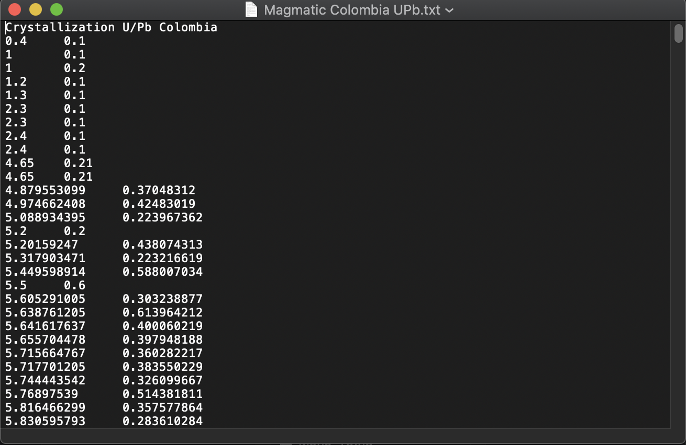

# HistogramsApp

## Introduction

The HistogramApp is a Python 3.6 installable application (Windows, Mac) that enables earth scientists and students to easily generate KDE and PDP plots from geochronological data. This application allows the interactive customization of plot parameters such as bandwidth, the plotting interval (in Ma), numbers of ticks, fontsize, number of histogram bins, and implements an algorithm for automated detection of peaks (https://gist.github.com/antiface/7177333). In addition, it enables the user to easily design the output plot layout and to compare multiple datasets by stacking them in a single publication quality plot. HistogramsApp is able to handle the processing of multiple datasets, which might contain more than 100.000 individual records. Therefore, the HistogramsApp enables the processing of large and regional or continental scale datasets that are relevant for understanding regional provenance, plate evolution and orogenic cycles, and the evolution of the continental crust through time. Output figures are exported in both .PNG and .PDF file formats. PFDs generated by the HistogramsApp are vectorized, therefore, can be further edited in software as Illustrator, InkScape, etc. 

## Contents of this Github repository

The App.py script contains the source code with the main structure of the HistogramsApp. Additional files include dependencies and scripts used by the application to properly work.

1. Sample Data for kick-starting CGD KDE and PDP plots generation!

2. Input Raw txt files must be placed in the /Data folder, which is automatically created within the yourUSER/CGD_DataStructure/ local directory once the application is launched for the first time.

3. The /Datasets folder contains a collection of datasets with a pre-defined as a demonstration of HistogramsApp capabilities.

4. The /Results folder contains all outputs produced by the application acoording to the text specified in the Dataset label.

## Terms of use and source code 

This application was developed under a GPL 3.0 licence. Free distribution and modification of the source code is allowed for academic purposes. Research outputs performed using this application must reference the CGD paper in their work.

## The citation to the paper:

Rodriguez-Corcho, A. F., Rojas-Agramonte, Y., González (2018, November). The Colombian geochronological database (CGD). International Geology Review, in review.

## Dowload the HistogramsApp 

The HistogramsApp can be downloaded from: 

### https://sourceforge.net/projects/histogramsapp/ 


by clicking on the green button within the red rectangles.


## Installation

After clicking on download (for Mac users) or selecting the "Files" label and downloading the build proper for your system, you will download an executable file. In Mac this file is named "HistogramsApp.dmg" and in Windows "HistogramsAppSetup.exe". 

1. For Mac, you only need to grab the HistogramsApp.app file to your Applications folder
2. For Windows, you need to click "next" and follow the remaining steps

### Once installed, the HistogramsApp will be available in your local system directory.

Mac            |  Windows
:-------------------------:|:-------------------------:
![]  |  ![]

# Tutorial

This tutorial will show you how to use the HistogramsApp and will guide through all its customization features and capabilities for geochronological data processing. The simple steps described in this tutorial are designed to achieve a plot like below in no more than one minute. Sample data provided by the Colombian Geochronological Database (CDG) is provided.



## Launching the HistogramsApp 

In order to launch the HistogramsApp you just need to open shortcuts to the application available in your local machine after installation.



Once you launch for the first time the HistogramsApp, a folder named: 

### "..CGD_DataStructure/" 

will be automatically created in yourLocal_USER_NAME/CGD_DataStructure. This folder contains by default sample data provided by the CGD.


Following the creating of CGD_DataStructure/, three sub-directories are created:

1. CGD_DataStructure/Data
2. CGD_DataStructure/Datasets
3. CGD_DataStructure/Results

## The Data folder 

The /Data/ directory contains the datasets of raw geochronological data intended to be processed using the HistogramsApp. Datasets of raw radiometric data must be placed within the /Data/ folder in .txt format order to be recongnized and properly loaded by the HistogramsApp.


### .txt files must follow the structure described in the table and image below:

Dataset Name                |  ""
:-------------------------:|:-------------------------:

Age (Ma)            |  Error (Ma)
:-------------------------:|:-------------------------:
40.8  |  1.6
20.3 |  4.5



Note that the first row (header) of the .txt file must ALWAYS be the name of the dataset and have only ONE column. For separating (since the second row) the age from the error, just a single space is needed.

### The two-columns structure required for the Age and error can be easily copied from excel after placing all ages and errors in two separated columns. Do not forget to use ALWAYS points for decimals.


## The Datasets folder

The datasets directory is where a collection of different datasets and figure customizations are stored. Each dataset file, of ".p: binary extension, contains all the necessary information for restart a previous work session in the HistogramsApp.


## The Results folder 

The results directory is where all output figures generated by the HistogramsApp will be located in the requested .PNG or .PDF format and with the name specified in the "DataSet form". Do not forget .PDF outputs can be edited with vector editing software.


## Plotting data

### Loading Raw Geochronological data

For loading raw data into the HistogramsApp you just need to click the "Load Data" button which will automatically open a new window in the /Data/ directory.


```python

```

## Making a Quick histogram plot


```python

```


```python
Customization of plot features
```


```python

```


```python
Histogram
```


```python

```


```python
Bw Change for KDE
```


```python

```


```python
Activating colors from USG geological scale 
```


```python

```


```python
Detecting peaks
```


```python

```


```python

```


```python
Default mode vs Shared axes
```


```python

```

## Datasets


```python
Datasets are...
```


```python
Creating datasets
```


```python

```


```python
Saving datasets
```


```python

```


```python
Loading datasets
```


```python

```


```python
Exporting
```


```python

```


```python

```


```python

```
