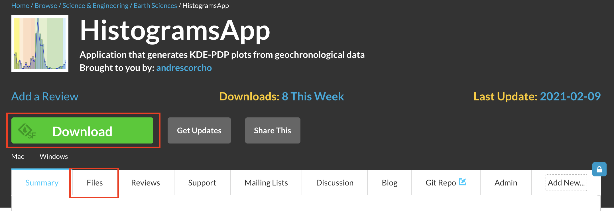
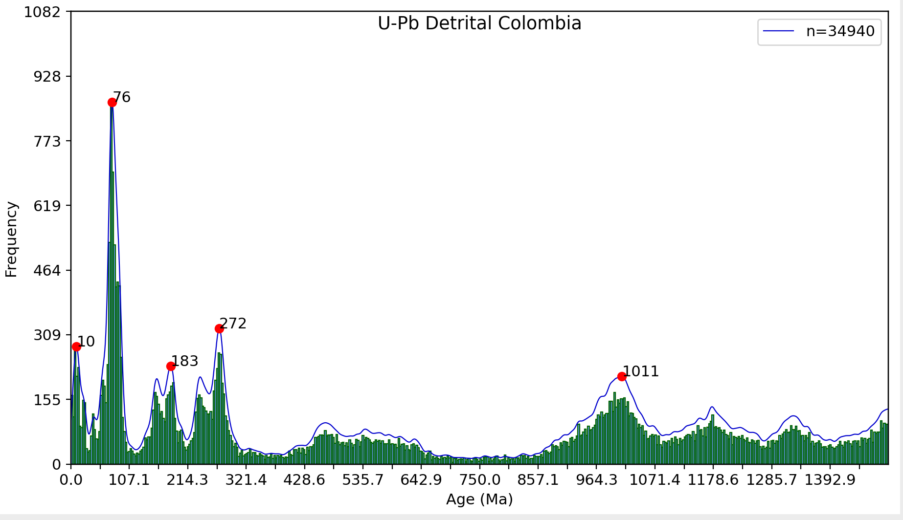
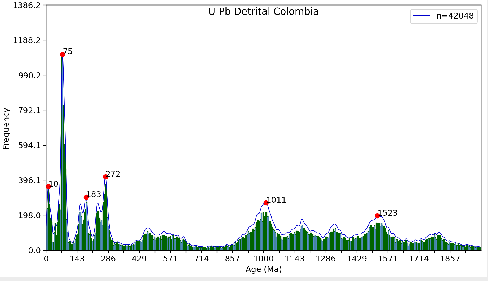
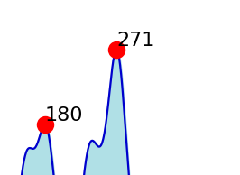
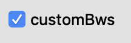
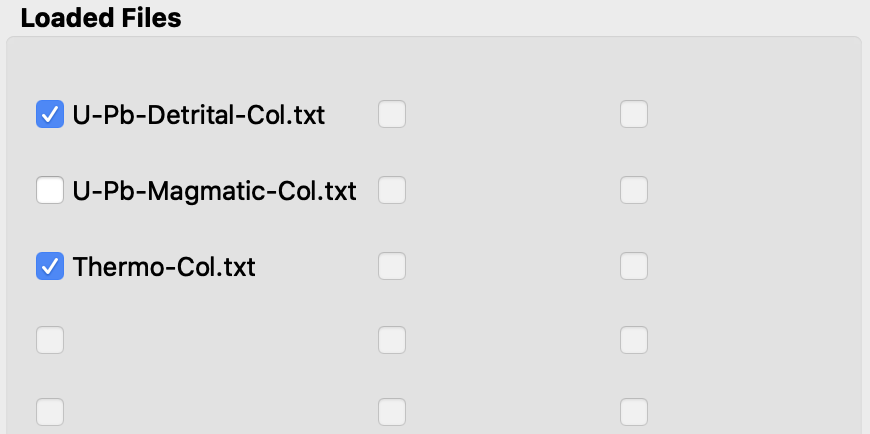
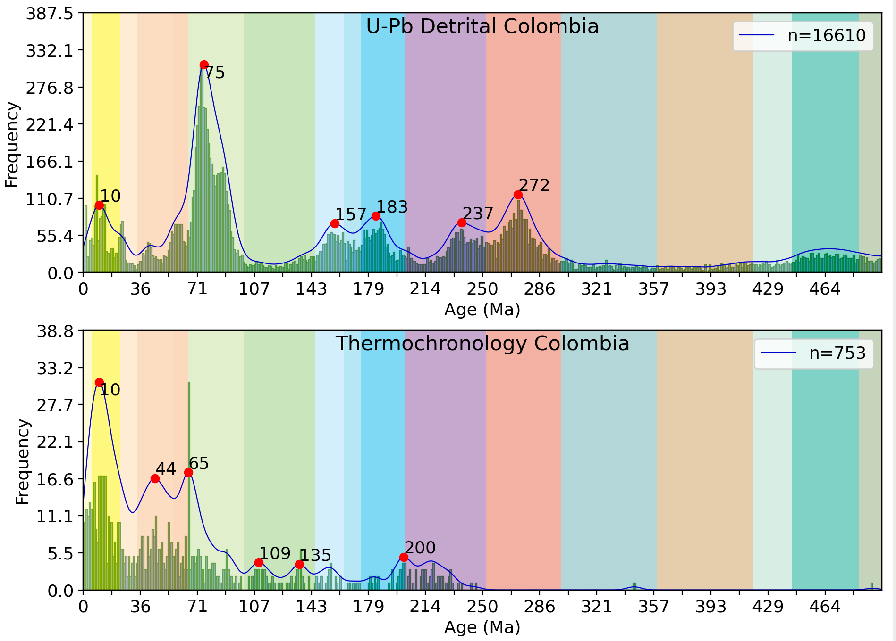

# The HistogramsApp - provided by the Colombian Geochronological database (CGD)

## Introduction

The HistogramApp is a Python 3.6 installable application (Windows, Mac) that enables earth scientists and students to easily generate KDE and PDP plots from geochronological data. This application allows the interactive customization of plot parameters such as bandwidth, the plotting interval (in Ma), numbers of ticks, fontsize, number of histogram bins, and implements an algorithm for automated detection of peaks (https://gist.github.com/antiface/7177333). In addition, it enables the user to easily design the output plot layout and to compare multiple datasets by stacking them in a single publication quality plot. HistogramsApp is able to handle the processing of multiple datasets, which might contain more than 100.000 individual records. Therefore, the HistogramsApp enables the processing of large and regional or continental scale datasets that are relevant for understanding regional provenance, plate evolution and orogenic cycles, and the evolution of the continental crust through time. Output figures are exported in both .PNG and .PDF file formats. PFDs generated by the HistogramsApp are vectorized, therefore, can be further edited in software as Illustrator, InkScape, etc. 

## Contents of this Github repository

The App.py script contains the source code with the main structure of the HistogramsApp. Additional files include dependencies and scripts used by the application to properly work.

1. Sample Data for kick-starting CGD KDE and PDP plots generation!

2. Input Raw txt files must be placed in the /Data folder, which is automatically created within the yourUSER/CGD_DataStructure/ local directory once the application is launched for the first time.

3. The /Datasets folder contains a collection of datasets with a pre-defined as a demonstration of HistogramsApp capabilities.

4. The /Results folder contains all outputs produced by the application acoording to the text specified in the Dataset label.

## Terms of use and source code 

This application was developed under a GPL 3.0 licence. Free distribution and modification of the source code is allowed for academic purposes. Research outputs performed using this application must reference the CGD paper in their work and the GitHub Repo where the original source code is available.

## The citation to the paper:

1. Rodriguez-Corcho, A. F., Rojas-Agramonte, Y., González, J., Marroquin., M., Bonilla, S., Izquierdo, D., ... (2020, February). The Colombian geochronological database (CGD). International Geology Review, in review.

2. Rodriguez-Corcho, and actions-user, 2021, andresrcorcho/CGD_HistogramsApp: HistogramsApp_1.3 (Version 1.3): Zenodo. doi:10.5281/zenodo.4593488

## Dowload the HistogramsApp 

The HistogramsApp can be downloaded from: 

### https://sourceforge.net/projects/histogramsapp/ 

by clicking on the green button within the red rectangles.

## Installation

After clicking on download (for Mac users) or selecting the "Files" label and downloading the build proper for your system, you will download an executable file. In Mac this file is named "HistogramsApp.dmg" and in Windows "HistogramsAppSetup.exe". 

1. For Mac, you only need to grab the HistogramsApp.app file to your Applications folder
2. For Windows, you need to click "next" and follow the remaining steps

### Once installed, the HistogramsApp will be available in your local system directory.

Mac            |  Windows
:-------------------------:|:-------------------------:
  |  

## For developers

If you are have expertise in using the Python programming language and the the "Terminal" in Mac/Linux or "Command line" in Windows, we recommended you to download the source code which is available in this GitHub Repository. For this you should follow these steps:

1. get the Application source code in your local machine by using "git clone https://github.com/andresrcorcho/CGD_HistogramsApp.git" in your terminal. Alternatively you can download the application source files directly from your web browser by clicking in the green button "Code". Then you can download the files using your method of preference.

#### Once you download the files the next step is to run the code. For this, you would need to have the Anaconda distribution of Python, that contains all packages needed for properly running the code. 

2. Open the terminal and type "python App.py"

# Tutorial

This tutorial will show you how to use the HistogramsApp and will guide through all its customization features and capabilities for geochronological data processing. The simple steps described in this tutorial are designed to achieve a plot like below in no more than one minute. Sample data provided by the Colombian Geochronological Database (CDG) is provided.

#### Do not forget that outputs can be easily edited in vector software. For example, it would take just a few secons in Adobe Illustrator to change the font size or the thickness of lines.  

## Launching the HistogramsApp 

In order to launch the HistogramsApp you just need to open shortcuts to the application available in your local machine after installation.

Once you launch for the first time the HistogramsApp, a folder named: 

### "..CGD_DataStructure/" 

will be automatically created in yourLocal_USER_NAME/CGD_DataStructure. This folder contains by default sample data provided by the CGD.

Following the creating of CGD_DataStructure/, three sub-directories are created:

1. CGD_DataStructure/Data
2. CGD_DataStructure/Datasets
3. CGD_DataStructure/Results

## The Data folder 

The /Data/ directory contains the datasets of raw geochronological data intended to be processed using the HistogramsApp. Datasets of raw radiometric data must be placed within the /Data/ folder in .txt format order to be recongnized and properly loaded by the HistogramsApp.

### .txt files must follow the structure described in the table and image below:

### First Line = 
Dataset Name           (If possible avoid spaces)

### Second Line = 
Default Bandwidth for Dataset (This would be the Bw used when the customBw option is checked)

### Third Line and so on = 

Age (Ma)            |  Error (Ma)
:-------------------------:|:-------------------------:
40.8  |  1.6
20.3 |  4.5

Note that the first row (header) of the .txt file must ALWAYS be the name of the dataset and have only ONE column. For separating (since the second row) the age from the error, just a single space is needed.

### The two-columns structure required for the Age and error can be easily copied from excel after placing all ages and errors in two separated columns. Do not forget to use ALWAYS points for decimals.

## The Datasets folder

The datasets directory is where a collection of different datasets and figure customizations are stored. Each dataset file, of ".p: binary extension, contains all the necessary information for restart a previous work session in the HistogramsApp.

## The Results folder 

The results directory is where all output figures generated by the HistogramsApp will be located in the requested .PNG or .PDF format and with the name specified in the "DataSet form". Do not forget .PDF outputs can be edited with vector editing software.

## Plotting data

### Loading Raw Geochronological data

For loading raw data into the HistogramsApp you just need to click the "Load Data" button (see red rectangle in the figure below) which will automatically open a new window in the /Data/ directory.

After clicking the "Load Data" button a window is automaically displayed. This window is launched in the /Data/ directory. Select any of the available .txt files in the folder and click "Open" as shown in the red rectangle in the image below.

Note that opening the "U-Pb-Detrital-Col.txt" file, that contains raw geochronological data, triggers the activation of one (red rectamgle) of the 18 empty slots that are located inside the "Loaded Files" panel (blue rectangles in the image below). Also note that the HistogramsApp identifies the loaded file by its original filename.

#### Hint: You can load multiple files at the same time and they will be allocated in the slots in the order they are loaded.

In total, you can load 18 different datasets into the HistogramsApp at the same time. Note how the checkbox at the left of the slot with the loaded file is automatically set as "Checked". In order to a data file to be considered for plotting it must be checked, otherwise the program will skip the file and get the data from the next allocated slot. If any loaded data file is set as "Checked" the program will not be able to plot anything.

#### In the image below you can see a "Checked" loaded file on the top, and a "UnChecked" one below.

### Making a Quick histogram plot

Now, we will do a quick plot with the U-Pb detrital zircon data we just loaded using the default plot parameters. For this, you will need to click the "Plot" button located at the bottom of the "Loaded Files" panel. See the location in the red rectangle shown in the image below.

You should get an output figure similar to the image below. If more than one slot contained data is selected, the resulting figure will be a subplot that stacks both datasets in the y-axis. By default, the size of the figure will be the size of the window that contains it. 

#### Important Info- Maximizing the application window will lead the figure size to increase. Changes in the size of the window may lead to expanding of shirnking of the figure size. For outputs with only one .txt file a small window size is recommended. A maximized window is recommended when plotting multiple datasets.

#### Note that the y-axis show the number of samples 

You can see that by using the default settings there are few details missing. In the section below, a detailed explanation of how to setup the customization features available in the "Parameters" label is provided.

## Customization of plot features

Plot features can be customized using the options available in the "Parameters" panel. A detailed explanation of the functionality of each parameter is provided below.

### 1. "Number of Ticks" = 
The number specified in the slider will be the number of ticks used for the x- axis (time in Ma). Tick values are calculated to satisfy the required number of ticks within the defined interval by Min. and Max.

#### Note how the resulting plot has exactly 8 ticks in the x-axis. 

### 2. "Set BandWidth" = 
The bandwidth used for generating the default Kernel density estimation (KDE). It can take values between 0.4 and 20 with steps of 0.4. Usually lower bandwidths (0.4-5) work for ages between 0-250 Ma, intermediate ones (5-8) for ages between 250-500 Ma, and higher ones (>8) for ages major than > 500 Ma. We interpret that this is due to the Pb-loss experienced in zircons by radioactive decay over long time scales.

#### A example of a plot using different Bandwidths 

Bw=0.8            |  Bw=6.4
:-------------------------:|:-------------------------:
  |  

#### Bw = 0.4

####  the interval of the plot in the x-axis is between(0-90Ma)

As you can see a lower Bw in the figure to the left allows to generate a clear spectra where peaks can be easily identified. On the other hand, the figure to the right presents a high Bw that averages the overall spectra, and obscure the peaks within the interval. A good choice of Bw will allow a great similarity between the histogram and density function plots.

#### A example of a plot using different Bandwidths 

Bw=0.8            |  Bw=6.4
:-------------------------:|:-------------------------:
  |  

#### Bw = 0.8

####  the interval of the plot in the x-axis is between(0-800Ma)

In contrast to the previous example, you can see that the spectra in the right has well-defined peaks than the left one for older ages, and a farily better one for the younger ones. Similarly, you can see that a wrong choice of Bw results in false peak detection.

### 3. "Min."
The "Min" field is where the minimum value (in million of years) of the x-axis of the plot must be specified. It can take any value, but you must ensure that the ages of your dataset are major than this value. Ages lesser than the specified minimum will not be displayed on the screen.

### 4. "Max."
The "Max" field is where the maximum value (in million of years) of the x-axis of the plot must be specified. It can take any value, but you must ensure that its value is major than "Min" and that ages of your dataset are not major than this value. Ages major than the specified mamximum will not be displayed on the screen.

### 5. "Save PDFs"
If this option is set as "Checked", the content displayed on the screen will the saved at the /Results/ directory as a .pdf file when clicking the "Plot" button and creating the figure. Output .pdf files can be loaded in vector editing software allowing a simple post-processing (when required).

Unchecked            |  Checked
:-------------------------:|:-------------------------:
  |  

### 6. "Save PNGs"
If this option is set as "Checked", the content displayed on the screen will the saved at the /Results/ directory as a .pdg image file when clicking the "Plot" button and creating the figure.

Unchecked            |  Checked
:-------------------------:|:-------------------------:
  |  

### 7. "Plot Bars"
If this option is set as "Checked", a histogram will be plotted on top of the density function. This histogram plot contains the number of "Bins" specified in the "Bins" field. In order to interactively compare the KDE version with and without histograms, everytome the "Plot Bars" option is checked or unchecked the screen is updated.

Unchecked            |  Checked
:-------------------------:|:-------------------------:
  |  

#### you will get a plot with bars on top of the density probability plot (but below the filling option).

### 8. "Bins"
This field is only enabled to be edited when the "Plot Bars" checkbox is set as "Checked". The value specified in this filed will be the number of bins used to construct the overlying histogram.

Unchecked            |  Checked
:-------------------------:|:-------------------------:
  |  

### 9. "Peak Detector"
If this option is set as "Checked", the peak detection slider (to the right) will be automatically activated. The value selected in the slider is the sensibility of the detection algorithm that will display the location of peaks in the screen of each one of the plots. Lower values will detect second and third order peaks and higher values just the major and more prominent peaks. Detected peaks are shown as red circles located on top of the probability density plot.

Unchecked            |  Checked
:-------------------------:|:-------------------------:
  |  

#### The number to the right of the silder shows the sensibility indicator 

#### Do not forget to click the "Plot" button for updating the screen after checking the "Peak Detector" option 

#### You will get one output like below

peak Detect = 5          |  peak Detect = 37
:-------------------------:|:-------------------------:
  |  

#### peak Detection = 5

### 10. "Label"
If this option is set as "Checked", the detected peaks labels will be displayed on the screen adjacent to the red point that marks each peak. To update the screen you need to click the "Plot" button.

Unchecked            |  Checked
:-------------------------:|:-------------------------:
  |  

### 11. "Adjust"
If this option is set as "Checked", an algorithm for automatic adjustment of peak labels will be activated. This algorithm will avoid overlaps of detected peak labels.

Unchecked            |  Checked
:-------------------------:|:-------------------------:
  |  

Default           |  Adjust Peaks
:-------------------------:|:-------------------------:
  |  

### 12. "PDP"
If this option is set as "Checked", a Probability Density Plot will be computed.

Unchecked            |  Checked
:-------------------------:|:-------------------------:
  |  

#### PDP plot. 

#### Note that the PDP plot can be displayed by checking at the tabs manager the "PDP" label, at the top panel of the main windows (Above the figure canvas).

### 13. "KDE-PDP"
If this option is set as "Checked", a figure with both the PDP and KDE plots will be computed in order to compare the differences and similarities in the results obtained by the two methods. It is important to clarify that peak detection is not allowed in this mode, as the PDP and KDE result can vary considerably. 

Unchecked            |  Checked
:-------------------------:|:-------------------------:
  |  

#### KDE and PDP plot. 

Note the subtle differences between the KDE and PDP plots for the case of the detrital zircons of Colombia. However, data with high dispersion can result in great differences between the KDE and PDP plots.

#### High disperssion of data results in differences in two approaches. Similarly, note that differences are more evident when plotting at a shorther interval of time.

### 14. "Shared Axes"
If this option is set as "Checked", the "default mode', one x and y label per axis, is changed by the "Shared Axes" mode where there is only one label in the x and y axes in the entire figure.

Unchecked            |  Checked
:-------------------------:|:-------------------------:
  |  

Shared Axes           |  Default mode
:-------------------------:|:-------------------------:
  |  

#### Default mode
 

#### Sharex axes mode

### 15. "Filled plot"
If this option is set as "Checked",

Unchecked            |  Checked
:-------------------------:|:-------------------------:
  |  

Not Filled           |  Filled
:-------------------------:|:-------------------------:
  |  

### 16. "GeoColors"
If this option is set as "Checked", the colors of the UGS geological time scale will be displayed in the background of the screen as vertical bars. This is ideal to easily put in a time framework the detected peaks.

Unchecked            |  Checked
:-------------------------:|:-------------------------:
  |  

Unchecked            |  Checked
:-------------------------:|:-------------------------:
  |  

#### No geocolors

### 17. "Y - Ticks"
If this option is set as "Checked", the ticks of the Y - axis will be displayed at the left axis of the plot. The values shown in the Y-Axis will be the number of samples within the interval defined by "Min" and "Max" calculated by generating an histogram using the default number of Bins value (500). In order to get an accurate estimation of the number of samples in the KDE/PDP function, the user must find the optimum number of Bins for the dataset. If "unChecked", the Y-Axis ticks will dissapear allowing to use the maximum space available for the plot. 

Unchecked            |  Checked
:-------------------------:|:-------------------------:
  |  

Unchecked            |  Checked
:-------------------------:|:-------------------------:
  |  

#### No Y mode plot
  

### 18. "Test Size"
The value specified in this field will be used by HistogramsApp to set the global text font size.

#### Text = 13 Figure

#### Text =8 Figure

### 19. "DecX"
If this option is set as "Checked", the x-axis will displays tick labels in decimal format (1 decimal digit).

Unchecked            |  Checked
:-------------------------:|:-------------------------:
  |  

Unchecked            |  Checked
:-------------------------:|:-------------------------:
  |  

#### Note the decimals in the X - axis

### 20. "DecY"
If this option is set as "Checked", the y-axis will displays tick labels in decimal format (1 decimal digit).

Unchecked            |  Checked
:-------------------------:|:-------------------------:
  |  

Unchecked            |  Checked
:-------------------------:|:-------------------------:
  |  

#### Note the decimals in the Y - axis
Unchecked            |  Checked
:-------------------------:|:-------------------------:
  |  

### Note that in both the X and Y axis the ticks are recalculated once the "DecX" or "DecY" options are activated.

### 21. "DecPeaks"
If this option is set as "Checked", the detected peak labels will be displayed in decimal format (1 decimal digit).

Unchecked            |  Checked
:-------------------------:|:-------------------------:
  |  

Unchecked            |  Checked
:-------------------------:|:-------------------------:
  |  

#### Note how the peak labels are displayed in a 1-digit decimal number

Unchecked            |  Checked
:-------------------------:|:-------------------------:
  |  

### 22. "customBws"
If this option is set as "Checked", the HistogramApp will use the Bws specified in each dataset raw .txt file, instead of the one chosen in the "Set BandWidth" slider. In order to set a custom bandwidth to a different value, the bandwidth value must be changed in the original .txt file, and the files must be ejected, an re-loaded into the HistogramApp. However, this is very easy if a previously generated "DataSet" file is loaded.

Unchecked            |  Checked
:-------------------------:|:-------------------------:
  |  

Unchecked            |  Checked
:-------------------------:|:-------------------------:
  |  

#### Note the different Bandwidths 0.8 for the top plot and 1.2 for the bottom one

Unchecked            |  Checked
:-------------------------:|:-------------------------:
  |  

### 23. "DataSet"

The "DataSet" field contains the text that will be used to name the output .PNG and .PDF files. The default value for this field is "Unnamed".

Default          |  Changed
:-------------------------:|:-------------------------:
  |  

### 24. "Expand Size"
If this option is set as "Checked", the sliders to the rigth will be activated and will allow to expand the size of the figure in the X and Y axes. This option is intented for fitting into the plot space more subplots than the allowed by the screen size.

Unchecked            |  Checked
:-------------------------:|:-------------------------:
  |  

#### The slider to the left modificates the Y axis size, and the one to the right the X axis. Note the scroll bars in the X and Y axis that allow to move through the figure.

####   

 

## Datasets

Datasets are a collection of many individual .txt data files. These files are stored in the ".p" binary format within the /Datasets/ folder. A dataset file will record the current customization variables specified by the user and also all the individual loaded .txt raw files for further processing.

### Creating datasets
To create a dataset you only need to click on the button "Save", choose a name for your dataset.p file, and click in the "Save" button of the emergent window. See location of red rectangles for locating the "Save" buttons in the image below.

### Loading datasets

To load a dataset you only need to click on the button "Load", and then to the button "Open". See location of red rectangles for locating the "Load" and "Open" buttons in the image below.

## Additional functionalities
Additional functionalities are implemented in the remaining buttons of the bottom of the "Loaded Files" panel:

### 1."Reset"
Restores to default all customization options and ejects all loaded .txt files from the HistogramsApp.
### 2. "Clear"
Ejects all loaded .txt files from the HistogramsApp but preserves current customization options.
### 3. "Flip"
When just and ONLY two individual .txt raw datasets are selected it allows to flip their position in the file slots panel.

Flip activated          |  Flip disabled
:-------------------------:|:-------------------------:
  |  

#### Note that the flip button only will be available when only TWO datasets are selected.
Before Flip        |  After Flip
:-------------------------:|:-------------------------:
  |  

Flip activated          |  Flip disabled
:-------------------------:|:-------------------------:
  |  

### Do not forget to properly cite the CDG paper when using the HistogramsApp or CDG datasets. 

1. Rodriguez-Corcho, A. F., Rojas-Agramonte, Y., González, J., Marroquin., M., Bonilla, S., Izquierdo, D., ... (2020, February). The Colombian geochronological database (CGD). International Geology Review, in review.

2. Rodriguez-Corcho, and actions-user, 2021, andresrcorcho/CGD_HistogramsApp: HistogramsApp_1.3 (Version 1.3): Zenodo. doi:10.5281/zenodo.4593488

Any further questions please contact me at rodrigueza2@student.unimelb.edu.au.
